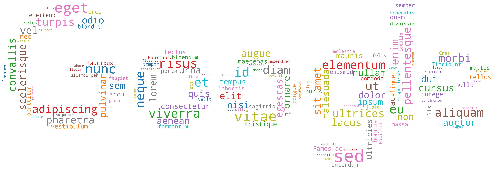

# google-search-word-cloud

Use this python script to parse your Google search history and turn it into a word cloud.

### Example
It looks like this, except with your top google search words instead of this Latin nonsense.

### Requirements
- matplotlib
- numpy
- pillow
- wordcloud

### Instructions
1. Go to [Google Takeout](https://takeout.google.com/) and select 'My Activity' to prepare for download. Make sure the format is html. (Didn't realize json was an option and I'm not rewriting my script)
2. Download once it's ready (it should only take a couple minutes if only activity is selected)
3. Move 'My Activity.html' from Takeout/My Activity/Search to repo directory
4. Run python script/ipython notebook and see full-sized output saved as 'googleWordCloud.png'